<div align="center">



<a href="https://www.linkedin.com/in/harshal-andhale/"></a> <a href="mailto:harshalandhale9@gmail.com"></a> <a href="https://github.com/HarshalAndhale9657?tab=repositories"></a> 

</div>

<br/>

<h3><code>harshal@github:~$ cat ./about.md</code></h3>

I build AI systems that have to survive contact with reality — where a hallucinated answer, an uncalibrated score, or an unverified patch is an actual failure, not a demo bug.

That constraint shapes everything I ship. **A.E.G.I.S.** refuses to open a pull request until it has *executed* the exploit it claims to have found. **Axiom** reports a rupee cost curve instead of a flattering AUC. **Groundwork** is built around calibrated abstention — a model that says *"not found in your history"* rather than inventing one. **P.R.I.S.M.** published a diagnostic showing its own v1 engine was near-noise, then rebuilt it and measured the replacement honestly.

Currently interning across two teams while finishing my CS degree — shipping a Chrome extension to **10K+ users** at Funlingo, and building AI workflows for pharmaceutical molecule prioritisation at SGRAMX.

```
Focus     LLM post-training (SFT · DPO) · agentic systems · RAG at scale · applied ML
Education B.E. Computer Science, Dr. D. Y. Patil Institute of Technology  ·  2024 – 2028
Open to   ML/AI engineering roles · research collaborations · open source
```

<br/>

<h3><code>harshal@github:~$ ./experience --list</code></h3>

<table>
<tr><td width="32%"><b>Software Engineer Intern</b><br/><sub>Funlingo · Remote</sub></td>
<td width="18%"><sub><code>Aug 2026 — present</code></sub></td>
<td>React Chrome extension serving <b>10K+ users</b> across <b>8 streaming platforms</b>. Also drives Next.js web + SEO work.</td></tr>

<tr><td><b>AI Engineer Intern</b><br/><sub>SGRAMX · Remote / Pune</sub></td>
<td><sub><code>Jul 2026 — present</code></sub></td>
<td>AI workflows for <b>PharmX</b> — drug-molecule evaluation, scoring and prioritisation, with multi-stakeholder criteria producing structured rankings.</td></tr>

<tr><td><b>LLM Post-Training Intern</b><br/><sub>Ethara AI · Remote / Gurugram</sub></td>
<td><sub><code>Feb 2026 — May 2026</code></sub></td>
<td><b>SFT and DPO</b> post-training for domain-specific models. Lifted reliability and output quality through data curation, prompt optimisation and evaluation.</td></tr>

<tr><td><b>ML Engineer Intern</b><br/><sub>Labmentix · Remote / Bengaluru</sub></td>
<td><sub><code>Dec 2025 — Feb 2026</code></sub></td>
<td>ML pipelines for tourism behaviour analysis; collaborative + content-based recommenders shipped through Streamlit.</td></tr>
</table>

<br/>

<h3><code>harshal@github:~$ ls ./flagship/</code></h3>

<table>
<tr>
<td width="50%" valign="top">

#### 🛡️ [A.E.G.I.S.](https://github.com/HarshalAndhale9657/ANVIL) · [live ↗](https://aegis-frontend-azure.vercel.app)

`Python` `FastAPI` `Colored Petri Nets` `LLM Agents` `OpenTelemetry`

An autonomous red-team engine that finds a vulnerability, **executes the exploit to prove it's real**, patches it, and opens the PR — with no human in the loop.

The interesting part is the failure handling. A **Colored Petri Net** governs execution, so the agent routes deterministically instead of death-spiralling on retries. Verification gates are **fail-closed**: unproven findings are discarded, not reported. Every decision is traced end-to-end via W3C distributed tracing, so the run is auditable rather than a black box.

</td>
<td width="50%" valign="top">

#### 🔬 [P.R.I.S.M.](https://github.com/HarshalAndhale9657/P.R.I.S.M) · [live ↗](https://p-r-i-s-m-psi.vercel.app/)

`Python` `FastAPI` `spaCy` `HDBSCAN` `OpenAlex` `GPT-4o`

Originality checker that catches **stitched plagiarism** — verbatim, paraphrased *and translated* — then attributes each span to its actual source.

**Precision 1.00 · Recall 0.86 · FPR 0.00** <sub>(controlled set, `eval_matcher.py`)</sub>

It's also the project I'm most willing to defend. v1 was stylometric; I benchmarked it, found the detection was **near-noise**, published the diagnostic in-repo, and rebuilt it around source attribution. The old claims are marked superseded rather than quietly deleted.

</td>
</tr>
<tr>
<td width="50%" valign="top">

#### 📊 [Axiom](https://github.com/HarshalAndhale9657/Axiom)

`LightGBM` `SHAP` `Gemini` `FastAPI` `Next.js`

RTO/COD fraud risk manager built for the **Razorpay AI Buildathon**. Blocking a good customer costs ~13× the fraud you prevent, so the headline metric is **rupees, not AUC**:

| Policy | ₹ / 1k orders |
|---|---:|
| Approve everything | ₹64,795 |
| Naive "block all COD" | ₹71,776 |
| **Axiom @ τ\*** | **₹49,254** |

Block-all-COD is *worse than doing nothing* — that result **is** the false-positive-cost argument. PR-AUC **0.51** at 0.17 prevalence, Brier **0.108**, ROC-AUC 0.80 — deliberately not a fake 0.99. Leakage-safe by construction, with a guard test that fails if any feature can see its own label.

</td>
<td width="50%" valign="top">

#### 🧠 [Groundwork](https://github.com/HarshalAndhale9657/LocalOS)

`Chrome MV3` `WXT` `Transformers.js` `PGlite` `QLoRA` `Ollama`

A local-first agentic browser assistant, and the research project behind my thesis on **calibrated grounding**: act only on what's on the page, answer only from what was actually read, and *abstain* otherwise.

Runs the full loop — observe (CDP a11y snapshot) → decide → risk-gate → confirm → act → re-observe — behind a SAFE/CAUTION/UNSAFE confirmation gate. Retrieval is cosine + time-decay + MMR + negative rejection over an in-browser Postgres. Ships with **Personal-Memory-RGB**, a purpose-built benchmark for refusal metrics. Nothing leaves the device.

</td>
</tr>
<tr>
<td width="50%" valign="top">

#### 🏛️ [CampusLens](https://github.com/HarshalAndhale9657/Campus-Lens) · [live ↗](https://campus-lens-delta.vercel.app/)

`React Three Fiber` `WebGL` `FastAPI` `Socket.IO` `RAG`

A real-time **3D digital twin** of a university campus. Rooms glow green when free, a live density heatmap flags overcrowding, and a RAG chatbot answers *"where is this professor teaching right now?"*

Built so the simulation engine can be swapped for real IoT sensors without touching the frontend.

</td>
<td width="50%" valign="top">

#### 💰 [Reconciliation Engine](https://github.com/HarshalAndhale9657/Reconcillation-Engine)

`TypeScript` `Kafka` `PostgreSQL` `Docker` `Microservices`

Event-driven financial reconciliation for ledger systems that receive **out-of-order and delayed** records from mismatched sources.

Kafka streaming, isolated ingestion and reconciliation services, deterministic matching, durable state in Postgres — built for replay and auditability. *Ingest once. Stream events. Reconcile deterministically.*

</td>
</tr>
</table>

<details>
<summary><b><code>harshal@github:~$ ls ./flagship/ --all</code></b> &nbsp;— five more worth opening</summary>

<br/>

| Project | What it is |
|---|---|
| 🔥 [**IncidentForge**](https://github.com/HarshalAndhale9657/OpenEnv) | An **OpenEnv RL environment** that trains LLMs to act as SREs — diagnosing and remediating incidents in simulated microservice infrastructure. Custom action and observation spaces, reward design, curriculum learning, baseline scores. Built for the **Meta × PyTorch** hackathon. |
| 🧠 [**Second Brain**](https://github.com/HarshalAndhale9657/SecondBrain) | Chrome extension running a complete RAG pipeline **entirely in-browser** — Transformers.js embeddings over **PGlite + pgvector** (WebAssembly Postgres) with HNSW indexing. Ask questions about anything you've read; nothing is uploaded. |
| 🎨 [**VEKTOR Studio**](https://github.com/HarshalAndhale9657/VEKTOR) | A production web studio site — full JSON-LD `ProfessionalService` schema, OG and Twitter cards, sitemap, hardened API routes. Real client-facing work, not a template. |
| 🏥 [**MediSense AI**](https://github.com/HarshalAndhale9657/MediSense-AI) | Multimodal health assistant on GPT-4o Vision — decodes medical reports, checks drug interactions, analyses skin conditions, serves first-aid guidance. |
| 🛢️ [**LeakSense**](https://github.com/HarshalAndhale9657/LeakSense-Dashboard) | IoT multi-gas leak detection. ESP32 → serial → SQLite → Flask/Socket.IO at 1 Hz, with auto-reconnect, an offline watchdog, and a simulator mode so it demos with no hardware attached. Runs unchanged on a laptop or a Raspberry Pi 4. |

</details>

<br/>

<h3><code>harshal@github:~$ ./metrics --render</code></h3>

<div align="center">

 


<sub>Rendered nightly by <a href="https://github.com/lowlighter/metrics">lowlighter/metrics</a> and committed into this repo — no third-party rate limits, no broken images.</sub>

</div>

<br/>

<h3><code>harshal@github:~$ cat ./stack.txt</code></h3>

<table>
<tr><td><b>AI / ML</b></td><td>


</td></tr>

<tr><td><b>LLM / Agents</b></td><td>


</td></tr>

<tr><td><b>Data / Vector</b></td><td>


</td></tr>

<tr><td><b>Backend</b></td><td>


</td></tr>

<tr><td><b>Frontend</b></td><td>


</td></tr>

<tr><td><b>Infra</b></td><td>


</td></tr>
</table>

<br/>

<h3><code>harshal@github:~$ ./achievements --verify</code></h3>

```
[✓] NPTEL · Introduction to Large Language Models — IIT Delhi
    Top 2% nationally · All India Rank under 100

[✓] DEVCLASH 2026 — Winner
    Pune's largest inter-collegiate hackathon · 50+ colleges

[✓] $750 Prototype Development Grant — La Trobe University, Australia

[✓] NPTEL · Introduction to Machine Learning — IIT Madras · Top 5%

[✓] Technical Lead — Computer Society of India (CSI), DYPIT chapter

[✓] Meta × PyTorch Hackathon — IncidentForge (OpenEnv RL environment)

[✓] 300+ DSA problems — LeetCode · GeeksforGeeks

[✓] Machine Learning Specialization · PyTorch for Deep Learning — DeepLearning.AI
```

<br/>

<h3><code>harshal@github:~$ ./connect --now</code></h3>

<div align="center">

<a href="https://www.linkedin.com/in/harshal-andhale/"></a> &nbsp; <a href="mailto:harshalandhale9@gmail.com"></a>

<br/>

<sub><i>Open to ML/AI engineering roles, research collaborations, and open-source work.<br/>If you're building something where being wrong is expensive — I'd like to hear about it.</i></sub>

<br/><br/>


</div>
